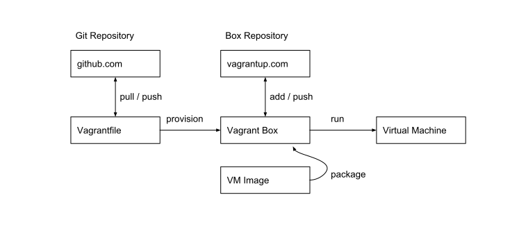

# Overview


# Quick start

Configuration file _Vagrantfile_
```ruby
Vagrant.configure("2") do |config|
  config.vm.box = "ubuntu/xenial64"
end
```
Command to make virtual environment up
```bash
vagrant up
```

To login your virtual machine with PuTTY, please refer [Putty Unable to Use Vagrant’s Private Key](http://www.alittleofboth.com/2014/04/putty-unable-to-use-vagrants-private-key/).

# Basic
## [init](https://www.vagrantup.com/docs/cli/init.html)
```
vagrant init ubuntu/xenial64
vagrant up
```

## [suspend](https://www.vagrantup.com/docs/cli/suspend.html) & [resume](https://www.vagrantup.com/docs/cli/resume.html)
```
vagrant suspend
vagrant resume
```

## [halt](https://www.vagrantup.com/docs/cli/halt.html) & [up](https://www.vagrantup.com/docs/cli/up.html)

After making any modifications to the Vagrantfile, a reload should be called.

```
# vagrant reload = vagrant halt + vagrant up.

vagrant halt   # shut down
vagrant up
vagrant reload
vagrant provision
```

## [destory](https://www.vagrantup.com/docs/cli/destroy.html)
```
vagrant destroy
```

# Basic++
> Vagrant = Box + Virtual Machine + Provisioning

Having a virtual machine ready is easy but not easier than setting up a real computer.
You need to 
1. install operating system. linux, Mac Os or windows.
2. setup the virtual machine. networking, shared folder.
3. install all the software.
Of course, after all setup, we can save it as an image, and load it anytime you need it.
However, when you install or update software, you have to create a new image.

Vagrant can help to do all things above and more.

## [Box](https://www.vagrantup.com/docs/boxes.html)
```
mkdir ubuntu16.04
cd ubuntu16.04
vagrant init ubuntu/xenial64
```
It creates a file Vagrantfile in the current directory.
The file Vagrantfile looks like this:
```
Vagrant.configure("2") do |config|
  config.vm.box = "ubuntu/xenial64"
end
```

Boxes have all the information required to install your system. e.g. the image for the virtual machine.
When you execute `vagrant init ubuntu/xenial64`, it will automatically download the box from online reporsitory to local disk, so that next time it will not download again when you create another virtual machine.
The corresponding box info is https://app.vagrantup.com/ubuntu/boxes/xenial64.
We can also use command `vagrant box` to manage box.

```
$ vagrant box add ubuntu/xenial64
$ vagrant box list
```

## [Virtual Machine](https://www.vagrantup.com/docs/providers/)
Vagrant supports different kind of virtual machines and call it [providers](https://www.vagrantup.com/docs/providers/). By default, it assume VirtualBox.

## [Provisioning](https://www.vagrantup.com/docs/provisioning/)

When virtual machine was first created from box, it has its own default public key in ~/.ssh/authorized_keys, and the box has the private key in host machine .vagrant\machines\default\virtualbox\private_key, so that vagrant can use ssh to login the virtual machine to do all the provision.

For security reason, on the first time vagrant up, vagrant will generate new public/private key to replace the default ones.

The Vagrantfile is the recipe to describe all the provision.

# My Vagrantfile
## Install Plugin
```
vagrant plugin install vagrant-disksize
```
## Vagrantfiles

1. [Vagrantfile-ubuntu-16.04](Vagrantfile-ubuntu-16.04) uses chef cookbooks [here](../Chef/cookbooks/), which have my own public key in [authorized_keys](../Chef/cookbooks/webdev/files/default/etc/skel/.ssh/authorized_keys).

# References
1. [Official Website](https://www.vagrantup.com/)
2. [Creating a Base Box](https://www.vagrantup.com/docs/virtualbox/boxes.html)
